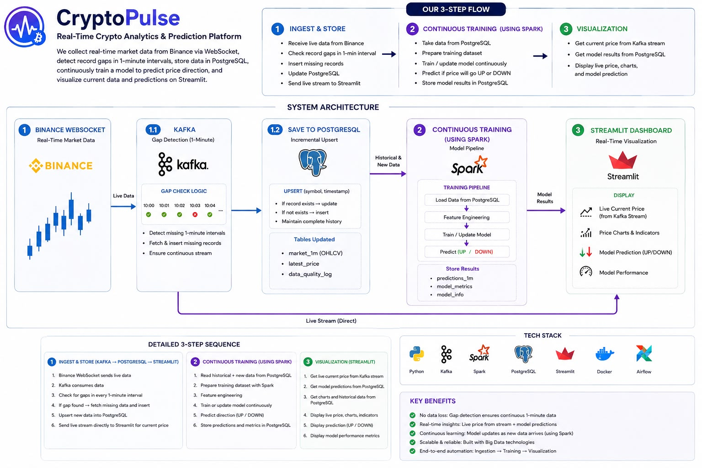

# 🕯️ CryptoPulse: End-to-End Real-Time Crypto Streaming & ML Pipeline

[](https://www.python.org/)
[](https://kafka.apache.org/)
[](https://spark.apache.org/)
[](https://airflow.apache.org/)
[](https://www.postgresql.org/)
[](https://streamlit.io/)
[](https://www.docker.com/)

**CryptoPulse** is an enterprise-grade, end-to-end data engineering and real-time analytics platform designed to ingest, process, store, orchestrate, and visualize high-frequency cryptocurrency market data.

It streams live 1-minute candlestick (OHLC) and real-time ticker data for the top 10 cryptocurrencies directly from the Binance WebSocket API, streams events through Apache Kafka, persists historical data in PostgreSQL, trains Machine Learning models using PySpark GBT, orchestrates pipelines with Apache Airflow, and visualizes live market movements on an interactive Streamlit dashboard.

---

## 📐 Architecture Overview



---

## ✨ Key Features

* **⚡ Real-Time WebSocket Data Ingestion**:
  Maintains a resilient multiplexed WebSocket connection to Binance for the top 10 cryptocurrency trading pairs (`BTCUSDT`, `ETHUSDT`, `BNBUSDT`, `SOLUSDT`, `XRPUSDT`, `ADAUSDT`, `DOGEUSDT`, `AVAXUSDT`, `LINKUSDT`, `DOTUSDT`).

* **📡 Event-Driven Architecture with Apache Kafka**:
  Decouples ingestion from downstream processing using Kafka topic `top10-crypto-live` for sub-second event distribution and consumption.

* **🔄 Automated Database Gap Filling & Resiliency**:
  On startup and during schedule runs, automatically calculates timestamp gaps between PostgreSQL and Binance REST API to backfill missing 1-minute candles seamlessly.

* **🤖 Distributed Machine Learning with PySpark**:
  Computes rolling window technical indicators (15m/1h moving averages, 15m volatility, price spreads, volume lags) and trains Gradient-Boosted Trees (`GBTClassifier`) to forecast price movement direction.

* **⚙️ Orchestration & Data Quality Governance with Apache Airflow**:
  Automated Airflow DAGs enforce pipeline ordering, SQL data quality integrity checks (detecting NULL prices or zero volumes), and periodic model retraining.

* **📊 Live Streamlit Candlestick Dashboard**:
  Features real-time 1-second auto-refreshing Plotly candlestick charts, OHLC metric indicators, streaming health indicators, and historical candle data inspection.

---

## 🛠️ Tech Stack & Components

| Layer | Technologies Used |
| :--- | :--- |
| **Streaming & Ingestion** | Python 3.11, Binance WebSocket API, `websocket-client`, `requests` |
| **Message Broker** | Apache Kafka 4.0 (KRaft Mode), `kafka-python`, Kafka UI |
| **Database & Storage** | PostgreSQL 16, pgAdmin 4 |
| **Distributed Processing & ML** | Apache Spark 3.5, PySpark MLlib (GBTClassifier, VectorAssembler) |
| **Orchestration** | Apache Airflow 2.8, BashOperator, SQLCheckOperator, TriggerDagRunOperator |
| **Frontend / Visualization** | Streamlit 1.30, Plotly Graph Objects, Pandas |
| **Containerization** | Docker, Docker Compose |

---

## 🌐 Service Ports & Access Web UIs

When the environment is running with Docker Compose, all services are mapped as follows:

| Service Name | Web URL / Host | Credentials / Notes |
| :--- | :--- | :--- |
| **Streamlit Dashboard** | [http://localhost:8501](http://localhost:8501) | Live Candlestick & Ticker UI |
| **Apache Airflow Webserver** | [http://localhost:8080](http://localhost:8080) | **User:** `admin` \| **Pass:** `admin123` |
| **Kafka UI** | [http://localhost:8081](http://localhost:8081) | Inspect topic `top10-crypto-live` |
| **pgAdmin 4** | [http://localhost:5050](http://localhost:5050) | **User:** `admin@cryptopulse.com` \| **Pass:** `admin123` |
| **PostgreSQL Database** | `localhost:5432` | **DB:** `cryptopulse_db` \| **User:** `cryptopulse` \| **Pass:** `cryptopulse123` |
| **Apache Spark Master** | [http://localhost:4040](http://localhost:4040) | Spark Application UI |

---

## 📁 Repository Structure

```
.
├── docker-compose.yml              # Central multi-container orchestrator configuration
├── requirements.txt                # Root Python dependencies
├── .env                            # Environment setup (e.g. AIRFLOW_UID)
├── README.md                       # Documentation & architecture guide
│
├── producer/                       # Ingestion Engine
│   └── producer.py                 # WebSocket client, Kafka producer & DB gap backfiller
│
├── streamlit/                      # Visualization Engine
│   ├── app.py                      # Real-time Streamlit dashboard with Plotly charts
│   ├── Dockerfile                  # Container definition for Streamlit
│   └── requirements.txt            # Streamlit container Python dependencies
│
├── spark/                          # PySpark Processing & ML Engine
│   ├── spark_streaming.py          # Feature extraction & GBT model training
│   ├── retrain_model.py            # Automated retraining script called by Airflow
│   ├── load_historical_data.py     # PySpark batch loader for CSV historical data
│   └── postgresql-42.7.7.jar       # JDBC PostgreSQL driver for Spark
│
├── airflow/                        # Pipeline Orchestration
│   └── dags/                       # Directed Acyclic Graphs (DAGs)
│       ├── master_dag.py           # Master crypto pipeline orchestrator
│       ├── crypto_gap_filler_dag.py# 10-minute automated database gap backfiller
│       ├── data_quality_dag.py     # Daily SQL integrity & completeness checks
│       └── model_retrain_dag.py    # Automated GBT model retrain workflow
│
├── scripts/                        # Utility & Helper Scripts
│   ├── init.sql                    # Initial database schema setup
│   ├── load_historical_data.py     # Python Pandas batch historical loader
│   └── update_db.py                # Standalone DB gap check script
│
├── data/                           # Data Storage
│   ├── historical_data/            # CSV files for 1-minute historical candles
│   └── postgre/                    # Database backups (cryptopulse_backup.sql)
│
└── models/                         # Trained Machine Learning Artifacts
    └── crypto_gbt_model/           # Persisted PySpark GBT Classifier pipeline
```

---

## 🚀 Quick Start Guide

### Prerequisites

Ensure you have installed:
* [Docker Desktop](https://www.docker.com/products/docker-desktop/) (with Docker Compose v2+)
* [Git](https://git-scm.com/)

---

### Step 1: Clone the Repository & Configure Environment

```bash
git clone https://github.com/your-username/Binance.git
cd Binance
```

Verify that `.env` contains:
```env
AIRFLOW_UID=50000
```

---

### Step 2: Spin Up the Infrastructure Stack

Launch all services in detached mode:

```bash
docker compose up -d
```

Check container status to verify all services are running:

```bash
docker compose ps
```

---

### Step 3: Seed Historical Data (First-Time Setup)

To load 1-year historical 1-minute OHLC CSV dataset into PostgreSQL:

```bash
docker exec -it cryptopulse-python python /app/scripts/load_historical_data.py
```

---

### Step 4: Open the Live Dashboard

Navigate to [http://localhost:8501](http://localhost:8501) in your browser to view the **Streamlit Candlestick Market Stream**. Select any of the top 10 cryptocurrencies (e.g. `BTCUSDT`, `ETHUSDT`, `SOLUSDT`) to view streaming 1-minute candles updated live from Kafka.

---

## 🔄 Airflow Workflow DAGs

| DAG ID | Schedule | Purpose |
| :--- | :--- | :--- |
| `master_crypto_orchestrator` | Manual / External | Master DAG triggering gap filling, quality validation, and model retraining in sequence. |
| `crypto_data_quality_dag` | `0 2 * * *` | Runs SQL integrity checks to ensure zero NULL close prices or volumes exist. |
| `crypto_gbt_retrain_dag` | Manual / Weekly | Triggers `spark/retrain_model.py` to retrain the GBT classifier on updated data. |

---

## 🤝 Contributing

Contributions, issues, and feature requests are welcome! Feel free to open an issue or submit a pull request.

---

## 📜 License

This project is licensed under the MIT License.
